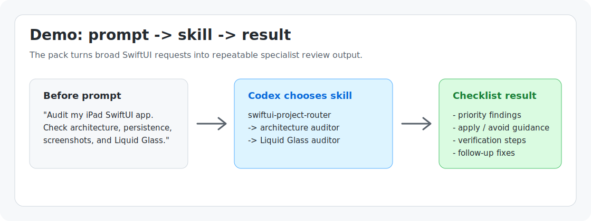

# Codex SwiftUI Developer Kit

Codex SwiftUI Developer Kit is an open-source Codex skill pack for building, auditing, debugging, diagnostics, redesigning, testing, screenshot-reviewing, and releasing SwiftUI, iOS, iPadOS, macOS, SwiftData, and Apple app projects.

It includes `liquid-glass-placement-auditor`, a dedicated skill for reviewing where Apple Liquid Glass should be applied or avoided in SwiftUI, iOS, iPadOS, and macOS apps.

## Quick Start

```bash
./scripts/install-local.sh
scripts/swiftui-kit.sh list
scripts/swiftui-kit.sh lint
scripts/swiftui-kit.sh benchmarks
./scripts/validate-skills.sh
```

## Quality Evidence

- Every skill has an explicit output contract, `Do Not Use When`, and `Done When`.
- Every skill has paired fictional good and bad output examples.
- Eight deterministic behavior fixtures compare weak baseline output with contract-compliant output.
- Skill lint, instruction-conflict checks, Markdown links, docs freshness, schemas, and scanner fixtures run from `./scripts/validate-skills.sh`.

## Safety

Scripts are non-destructive. Builds and launches follow host-project approval. Screenshots, Appshots, Simulator capture, and Computer Use always require explicit approval, and examples contain no private project data.

## Why SwiftUI Developers Need This

Apple app work often repeats the same review loops: inspect SwiftUI state, check navigation, debug Xcode schemes, build useful diagnostics, review Simulator screenshots, decide where Liquid Glass belongs, audit SwiftData risk, and prepare App Store releases. This repository packages those workflows as reusable Codex skills so the same checks can be run consistently across projects.

SwiftUI developers need this because the hard parts are rarely one isolated file. A useful audit usually crosses architecture, SwiftData persistence, Xcode schemes, screenshots, accessibility, App Store checks, and design-system choices. This pack gives Codex a repeatable checklist for those repeated reviews instead of starting from a blank prompt every time.

## Proof From Real Audits

The workflows have already been used on a private iPad SwiftUI app audit. The public summary below removes app names, file paths, and private project details while keeping the useful signal:

- `liquid-glass-placement-auditor` plus `swiftui-liquid-glass` identified the best Liquid Glass targets as floating canvas chrome, compact board switching controls, transient tool inspectors, search fields, and popovers.
- The same audit recommended avoiding glass on reading, writing, recall, PDF, error, and destructive-action surfaces where stable contrast matters more than depth.
- `swiftui-architecture-auditor` found concrete engineering risks: a resize commit path that could persist old dimensions, board write errors being swallowed, and oversized board/root files concentrating gesture, persistence, and rendering responsibilities.
- The recommended fix order separated immediate correctness bugs from larger refactors, then tied the result to simulator-based verification before UI confidence was treated as high.

## What Codex Skills Are

Codex skills are structured workflow folders. Each skill has a `SKILL.md` file with YAML frontmatter and focused instructions. Skills can also include reference checklists, output contracts, and safe scripts. Codex reads the skill when the user's request matches its trigger-focused description.

## What This Pack Includes

| Skill | Purpose | Use When |
| --- | --- | --- |
| `swiftui-project-router` | Select the right specialist workflow | The request is broad or spans multiple Apple app tasks |
| `swiftui-feature-builder` | Plan and build SwiftUI features | Adding or modifying app functionality |
| `swiftui-diagnostics-builder` | Build AI-readable app diagnostics | Logs, breadcrumbs, issue reports, MetricKit, signposts, TestFlight feedback, and privacy-safe bug reports |
| `swiftui-ui-patterns` | Shape SwiftUI screen composition | Choosing state ownership, navigation, sheets, async loading, previews, and view refactors |
| `swiftui-design-system-auditor` | Audit Apple UI design quality | Layout hierarchy, typography, spacing, SF Symbols, toolbars, empty states, iPad/macOS fit, keyboard, pointer, and Apple Pencil workflows |
| `canvas-engine-auditor` | Audit iPad canvas engines | PencilKit, Apple Pencil, drawing, handwriting, zoom/pan, coordinates, highlighter opacity, layers, PDF annotation, persistence, undo/redo, and canvas performance bugs |
| `liquid-glass-placement-auditor` | Audit where Liquid Glass belongs | Modernizing UI, reviewing chrome, toolbars, panels, or screenshots |
| `simulator-screenshot-reviewer` | Capture and review Simulator screenshots | Looking for visual, layout, hierarchy, or readability issues |
| `swiftui-architecture-auditor` | Review architecture and maintainability | State ownership, navigation, async, huge views, and boundaries |
| `swiftdata-persistence-auditor` | Review SwiftData persistence | Models, queries, deletes, migrations, and data-loss risk |
| `xcode-build-debugger` | Diagnose Xcode build problems | Build errors, schemes, simulators, dependencies, and signing hints |
| `accessibility-auditor` | Review accessibility | VoiceOver, Dynamic Type, contrast, tap targets, and motion settings |
| `appstore-release-reviewer` | Review release readiness | TestFlight, App Store, privacy, metadata, screenshots, and signing |
| `test-coverage-improver` | Improve test coverage | Finding high-impact tests for ViewModels, repositories, services, and regressions |
| `pr-draft-generator` | Draft pull request material | PR titles, summaries, testing checklists, risks, and release notes |

The repository also includes `scripts/validate-skills.sh` and a GitHub Actions workflow to validate skill frontmatter, required references, shell syntax, examples, and safety gates.

## Release Notes

Upcoming release: [v0.2.0 - Canvas and Diagnostics Workflows](docs/releases/v0.2.0.md).

Current release: [v0.1.0 - Initial SwiftUI Codex Skill Pack](docs/releases/v0.1.0.md).

## Command Vocabulary And CLI

For broad requests, use `swiftui-project-router` with a short command:

| Command | What It Does |
| --- | --- |
| `audit` | Review project quality and route to the right specialist audits |
| `canvas-audit` | Audit drawing, PencilKit, zoom/pan, gestures, layers, persistence, undo/redo, and canvas performance |
| `fix-build` | Diagnose Xcode, SwiftPM, scheme, simulator, signing, and compiler failures |
| `diagnostics` | Build or review privacy-safe app diagnostics, issue reports, breadcrumbs, logs, MetricKit, and signposts |
| `review-screenshots` | Review Simulator screenshots after consent and privacy checks |
| `prepare-release` | Check TestFlight, App Store, metadata, privacy, screenshots, and signing |
| `modernize-ui` | Review SwiftUI design quality, UI patterns, and Liquid Glass placement |
| `improve-tests` | Find high-impact missing ViewModel, repository, service, and regression tests |
| `draft-pr` | Draft PR title, body, testing checklist, risks, and release notes |
| `detect-risks` | Run deterministic SwiftUI source checks, then route findings to the right audit |

Example:

```text
Use the swiftui-project-router skill. detect-risks in this SwiftUI project.
```

```text
Use the swiftui-project-router skill. canvas-audit my iPad drawing canvas for coordinate drift, PencilKit state, highlighter opacity, save/reopen, and gesture conflicts.
```

```text
Use the swiftui-project-router skill. diagnostics for canvas and SwiftData bug reports.
```

The repo-local CLI wraps common maintenance workflows:

```bash
scripts/swiftui-kit.sh list
scripts/swiftui-kit.sh detect --format markdown .
scripts/swiftui-kit.sh lint
scripts/swiftui-kit.sh doctor
scripts/swiftui-kit.sh bundle --output .tmp/swiftui-kit-dist
scripts/swiftui-kit.sh validate
```

`scripts/detect-swiftui-antipatterns.sh` is read-only. It flags deterministic SwiftUI risk signals such as oversized SwiftUI view files, unlabeled symbol-only buttons, lifecycle-created unstructured tasks, hardcoded colors, and suspicious SwiftData delete paths.

`scripts/swiftui-kit.sh lint` is also read-only. It checks skill size and trigger descriptions, detects instruction conflicts such as broad build/run approval, and verifies local Markdown links.

Worked output:

```markdown
- **image-button-missing-accessibility-label** `StudyOS/Sources/StudyPlanDashboard.swift:42` [high]: A button appears to rely on an SF Symbol without an accessibility label. Add a clear .accessibilityLabel or use a Label with visible text.
- **swiftdata-delete-without-recovery-signal** `StudyOS/Sources/StudyPlanDashboard.swift:112` [high]: SwiftData delete path has no nearby confirmation or recovery signal. Verify destructive actions have confirmation, undo, or a clear recovery path.

Findings: 5
```

See [examples/detect-risks-example.md](examples/detect-risks-example.md) for a full `detect-risks` example with prompt, command, scanner output, and follow-up fix prompt.

See [docs/detector-roadmap.md](docs/detector-roadmap.md) for planned scanner rules that should stay low-noise before being added.

## Demo



Example:

| Step | Example |
| --- | --- |
| Before prompt | `Audit my iPad SwiftUI app. Check architecture, SwiftData, screenshots, accessibility, and Liquid Glass placement.` |
| Codex chooses skill | `swiftui-project-router` selects the specialist audits, such as `swiftui-architecture-auditor`, `canvas-engine-auditor`, `swiftdata-persistence-auditor`, `simulator-screenshot-reviewer`, `accessibility-auditor`, and `liquid-glass-placement-auditor`. |
| Output checklist/result | Codex returns prioritized findings, evidence, recommended fix order, apply/avoid guidance for Liquid Glass, and verification steps. |

The key behavior is not a generic answer. The skills push Codex toward structured output with severity, confidence, file evidence when available, and a practical next action.

The StudyOS examples are fictional. See [docs/demo-roadmap.md](docs/demo-roadmap.md) for the implemented public demo and optional future visual evidence.

For a code-only static scan, see the worked [`detect-risks` example](examples/detect-risks-example.md).

## Installation

Clone the repository:

```bash
git clone https://github.com/7vibex/swiftui-developer-kit.git
cd swiftui-developer-kit
```

Use the skills by pointing Codex at this repository, or copy `.agents/skills/` into a Codex-compatible skills location if your environment supports local skill discovery. Current Codex skill locations are:

```text
Repo-local: .agents/skills
User-local: ~/.agents/skills
Admin: /etc/codex/skills
```

You can also give Codex the repository link and ask it to install the pack for local use:

```text
Install the Codex skills from https://github.com/7vibex/swiftui-developer-kit so I can use them locally.
```

Codex should clone or inspect the repository, run the local installer, and confirm the skills are available in `~/.agents/skills`.

The upcoming v0.2.0 installer defaults to `~/.agents/skills`. Use `./scripts/install-local.sh --target /path/to/codex/skills` only when your Codex environment expects a different user skill directory.

For local Codex installs, use the installer:

```bash
./scripts/install-local.sh
```

It symlinks the 15 skills into `~/.agents/skills` by default, skips existing skills, and prints the next prompt to try. Restart Codex after installing.

For an already-installed local setup, refresh symlinks from the current checkout:

```bash
./scripts/install-local.sh --refresh
```

`--refresh` relinks existing symlinks. If an existing entry is a real file or directory, the installer moves it to a timestamped backup path before replacing it.

See [docs/installation.md](docs/installation.md) for more detail.

Provider bundles can be generated for Codex/generic agents, Claude Code, Cursor, Gemini CLI, GitHub Copilot, and OpenCode:

```bash
scripts/swiftui-kit.sh bundle --output .tmp/swiftui-kit-providers
```

The generated output is intended for distribution and should not be committed back into this repository.

## Using The Router Skill

Use the router when you want Codex to choose the right workflow:

```text
Use the swiftui-project-router skill. I want to audit my SwiftUI app and decide which workflows are needed.
```

The router should return the selected workflow, why it was selected, needed inputs, and the next action. It does not claim to automatically invoke other skills.

## Using Specialist Skills Directly

Use a specialist skill when the workflow is clear:

```text
Use the swiftui-architecture-auditor skill. Review my SwiftUI project for state management, navigation, async, and maintainability problems.
```

```text
Use the swiftui-ui-patterns skill. Refactor this SwiftUI screen's state, sheets, previews, and view structure.
```

```text
Use the swiftui-design-system-auditor skill. Review whether this iPad UI feels native and usable.
```

```text
Use the swiftui-diagnostics-builder skill. Add a privacy-safe Report Issue workflow with logs, breadcrumbs, app-state snapshots, and AI-readable export JSON.
```

```text
Use the appstore-release-reviewer skill. Check whether my iOS app is ready for TestFlight and App Store submission.
```

## Simulator Screenshot Workflow

The screenshot workflows are consent-first. A skill must ask whether Simulator is open, what screen should be captured, and whether anything sensitive is visible before capturing. When approved, scripts can use:

```bash
xcrun simctl io booted screenshot
```

Screenshots should be named clearly, such as `01-home.png` or `02-canvas.png`, and tracked in a screenshot inventory.

Example prompt:

```text
Use the liquid-glass-placement-auditor skill. My SwiftUI app is running in the iPad Simulator. Ask me before taking screenshots, then review the main screens and tell me where Liquid Glass should be used or avoided.
```

## Appshots Workflow

Appshots may capture the frontmost app window. The user must bring the intended window forward and must not expose sensitive windows, passwords, private chats, personal documents, production secrets, tokens, API keys, or private data. macOS may require Screen Recording or Accessibility permissions.

## Privacy And Safety

Do not capture screenshots, Appshots, or use Computer Use without asking first. Do not capture sensitive windows. Do not upload secrets, private production data, or personal documents. Scripts in this repository are intended to be non-destructive: they inspect, list, create folders, and capture only after user approval.

See [docs/safety-and-privacy.md](docs/safety-and-privacy.md) and [SECURITY.md](SECURITY.md).

## AI Usage Policy

AI is used in this project to help with review, documentation, examples, tests, issue triage, and maintenance. AI output must be reviewed before it becomes project guidance or code.

This project does not accept unreviewed generated code, unsafe automation, secret-handling shortcuts, or screenshot capture without explicit user consent. Human review is required for behavior changes, release decisions, safety policy changes, and any workflow that could affect private user data or local projects.

## Apple Documentation Policy

Reference files link to official Apple documentation and summarize practical review points. They do not copy large Apple documentation pages. When Apple guidance matters, prefer official links and short summaries.

## Example Prompts

```text
Use the swiftui-project-router skill. I want to audit my SwiftUI app and decide which workflows are needed.
```

```text
Use the liquid-glass-placement-auditor skill. My SwiftUI app is running in the iPad Simulator. Ask me before taking screenshots, then review the main screens and tell me where Liquid Glass should be used or avoided.
```

```text
Use the canvas-engine-auditor skill. Audit my iPad canvas for PencilKit drawing bugs, coordinate drift after zooming, highlighter opacity, layers reopening in old positions, gesture conflicts, persistence loss, performance, and missing regression tests.
```

```text
Use the swiftui-architecture-auditor skill. Review my SwiftUI project for state management, navigation, async, and maintainability problems.
```

```text
Use the appstore-release-reviewer skill. Check whether my iOS app is ready for TestFlight and App Store submission.
```

## Roadmap

- Add a watchOS skill for watch app audits and release readiness.
- Add visionOS examples that show spatial UI review prompts and output contracts.
- Expand deterministic SwiftUI risk detection with additional rules once the first scanner rules prove useful.

## Contributing

Contributions are welcome. Keep skills concise, trigger-focused, and safe. New skills should include references, an output contract, examples, and documentation updates.

See [CONTRIBUTING.md](CONTRIBUTING.md).

## License

MIT License. See [LICENSE](LICENSE).
